# Classroom Learning Game Platform

A lightweight, scalable classroom learning game platform designed for teachers and students to participate in interactive learning sessions together.

The initial use case is similar to Kahoot, but built internally to provide more flexibility, lower cost at scale, and better ownership of learning data and reporting.

---

## Screenshots

### Start

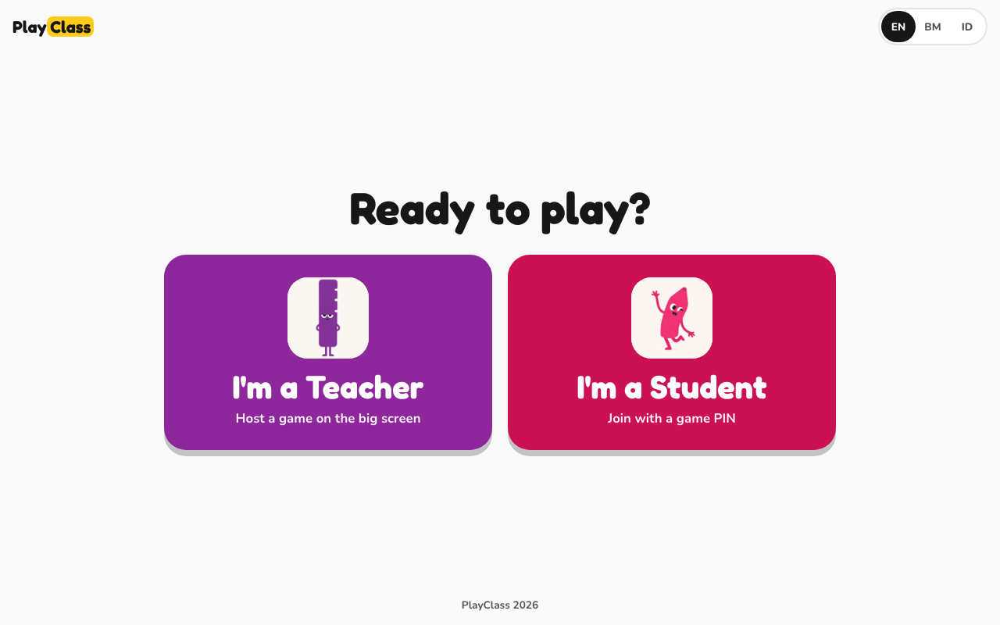

### Live game — teacher screen

| Lobby with the game PIN | Question with live ranking |
|---|---|
| 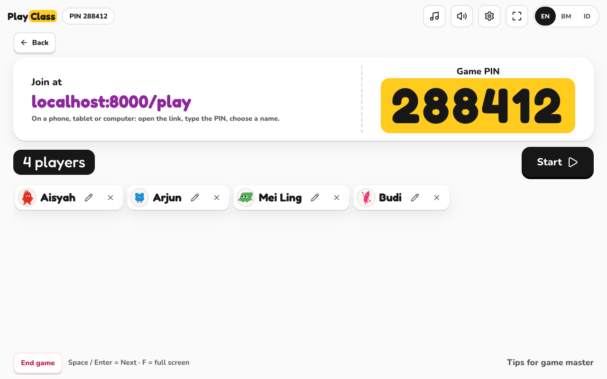 | 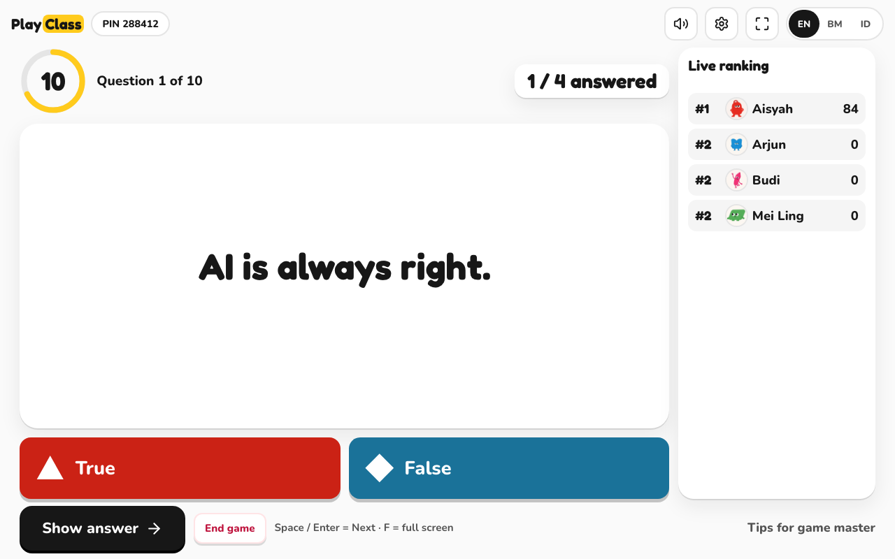 |
| **Answer reveal** | **Leaderboard** |
| 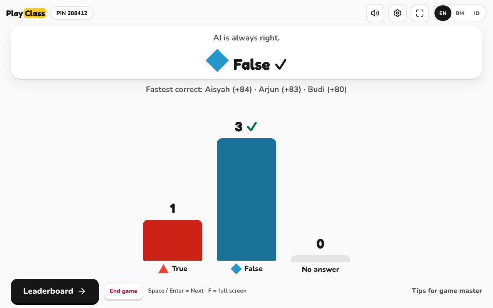 | 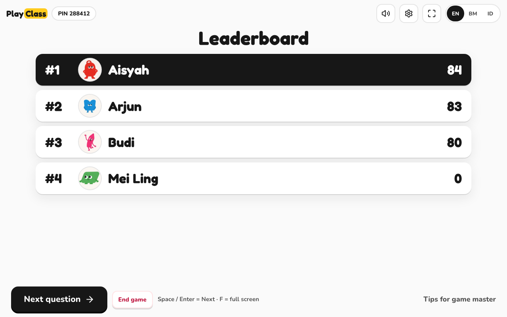 |

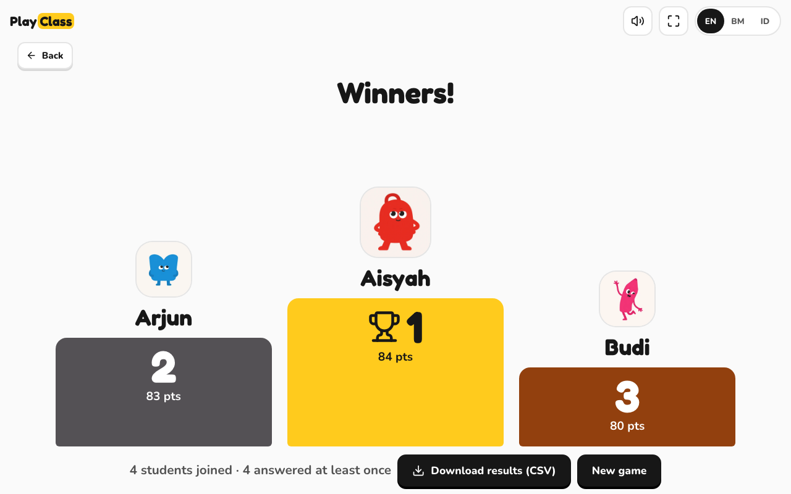

### Live game — student phone

| Join with PIN | Answer | Instant result |
|---|---|---|
| 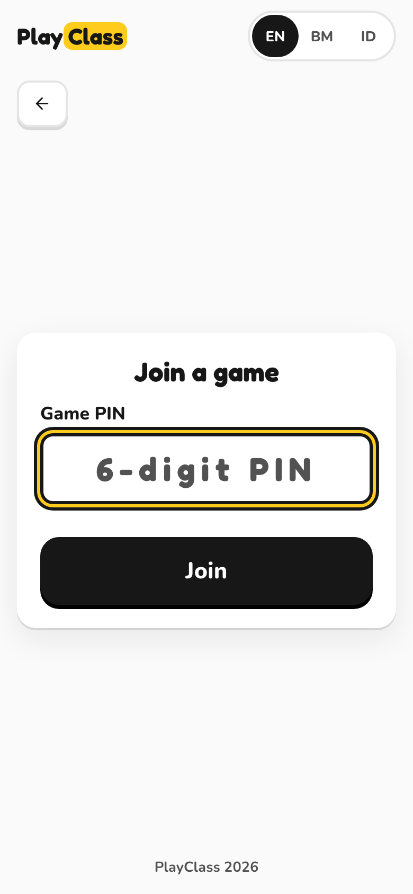 | 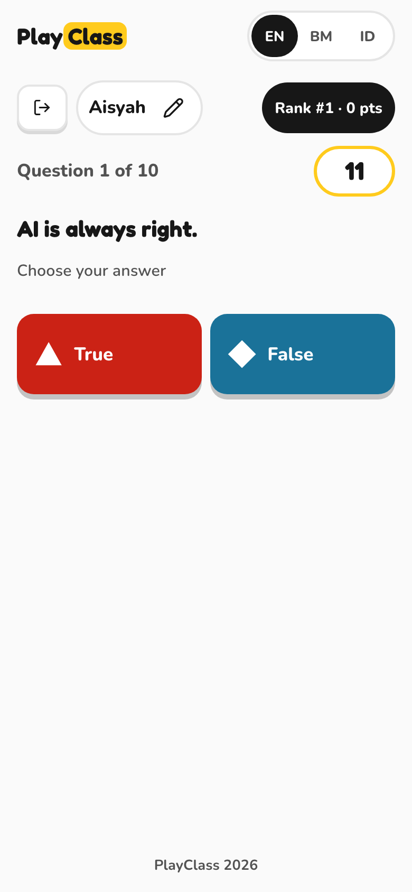 | 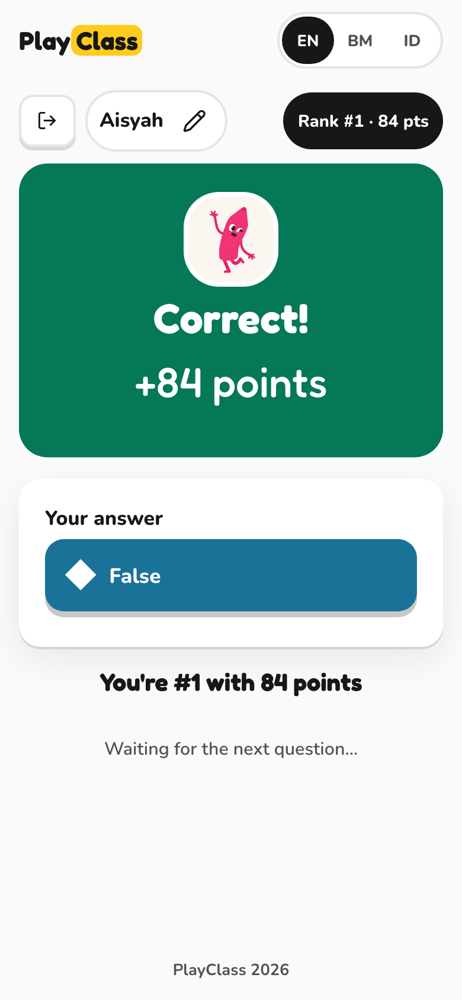 |

### Teacher presents (one screen, individuals or groups)

| Setup: pick a pack, paste names, make teams | Projector stage: team turn, timer, tips |
|---|---|
| 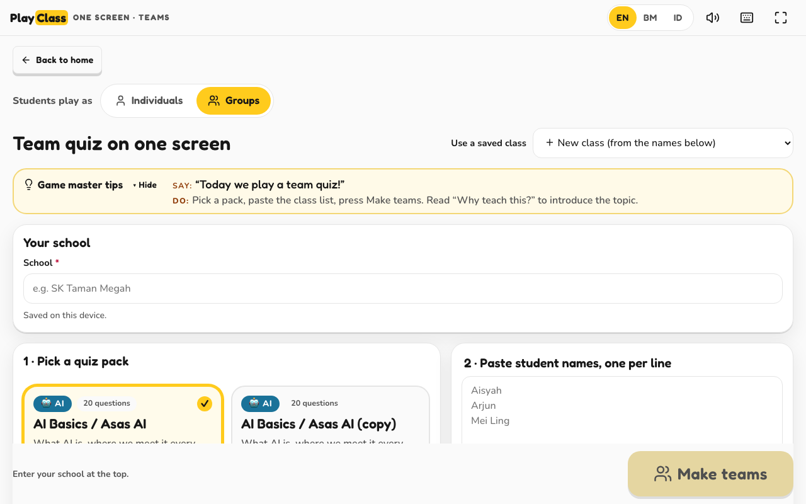 | 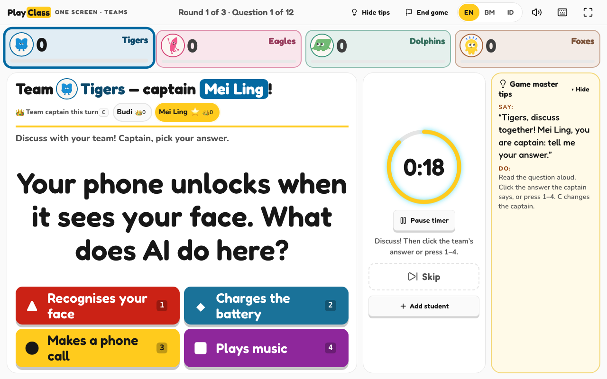 |

### Program reports

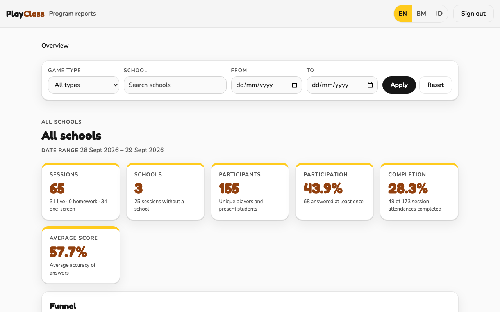

---

## 1. Project Context

The platform should support a **Training for Trainers (ToT)** model, where teachers can operate the platform themselves without requiring our team to be present on-site.

The system should be simple enough for a beginner teacher to understand and operate.

---

## 2. Current Problems

The current learning setup has several limitations:

1. The current learning tool cannot properly support collaborative classroom learning.
2. Students may not be allowed to bring smartphones to school.
3. It is difficult to accurately measure classroom participation.
4. There is no live leaderboard/scoring experience.
5. Existing tools such as Kahoot can become expensive for large-scale usage.
6. The current process still requires a Game Master to operate the experience.

A previous game console created for the Speechmakers program showed that this type of interactive learning experience can be highly engaging for both teachers and students.

The goal is to turn this concept into a reusable and scalable platform.

---

# 3. Product Goal

Build a simple internal learning game platform that allows:

* Teachers to run interactive learning sessions.
* Students to join using a session code/PIN.
* Students to answer questions individually or in groups.
* The system to calculate scores automatically.
* Teachers and students to see a real-time leaderboard.
* Program teams to measure participation and learning progress.
* Teachers to operate the entire session without technical assistance.

---

# 4. Target Users

## Teacher / Game Master

The teacher operates the session.

The teacher should be able to:

* Create a session.
* Select learning content.
* Create or edit questions.
* Start/stop activities.
* Monitor participants.
* View answers.
* View leaderboard.
* End the session.
* View basic results.

The teacher may receive AI-generated question recommendations but should also be able to create their own questions.

---

## Student

Students participate in the learning session.

Students should be able to:

* Join using a PIN/code.
* Enter their name.
* Answer questions.
* Participate individually or in groups.
* View their score.
* View the leaderboard.

The student experience should require minimal setup.

---

# 5. Core Learning Modes

## Individual

Each student answers independently.

Example:

```text
Question
   ↓
Student answers
   ↓
Score calculated
   ↓
Leaderboard updated
```

## Group

Students participate as a team.

Possible activities:

* Group discussion
* Presentation
* Collaborative problem solving
* Team challenge

Group scoring can initially be simple: one score belongs to the group.

---

# 6. Core Session Flow

```text
Teacher creates session
        ↓
System generates PIN
        ↓
Students join
        ↓
Teacher starts activity
        ↓
Students answer
        ↓
System calculates score
        ↓
Leaderboard updates
        ↓
Teacher starts next activity
        ↓
Session ends
        ↓
Basic report generated
```

---

# 7. Question & Content

The platform should not be hard-coded for a single subject.

The same game engine should support different programs.

---

# 8. Content Creation

Teachers should be able to:

* Add questions manually.
* Edit questions.
* Delete questions.
* Reorder questions.
* Use AI-generated question recommendations.

There was also a discussion about using **Amazon PartyRock** as a reference for AI/content prototyping.

The team will provide additional information regarding the existing PartyRock approach.

The creator of the existing game console prototype should also be consulted.

---

# 9. Leaderboard

The platform must provide a real-time leaderboard.

Example:

```text
🏆 Leaderboard

1. John       950
2. Sarah      900
3. Adam       850
4. Aisyah     800
```

Leaderboard should support:

* Individual ranking.
* Group ranking.
* Real-time score updates.
* Display name.

Teachers should have the ability to manage/change participant display names when necessary.

---

# 10. Reporting

The first version does not need complex analytics.

The system should capture enough data to support basic reporting.

### School

* School
* Number of students
* Participation
* Sessions
* Average score

### Class

* Class
* Number of students
* Participation
* Average score
* Progress

### Student

* Student name
* Sessions attended
* Score
* Progress
* Improvement

### Program

* Total participants
* Sessions
* Participation
* Score
* Learning progress
* Program duration

---

# 11. Progress & Improvement

The system should eventually be able to measure improvement between learning levels/sessions.

Example:

```text
Level 1 → 55%
Level 2 → 68%
Level 3 → 78%
Level 4 → 86%
```

For MVP, simple score/progress tracking is sufficient.

Advanced learning analytics can be added later.

---

# 12. Funnel & Retention

The meeting identified the need to eventually measure:

```text
Registered
    ↓
Joined Session
    ↓
Participated
    ↓
Completed Session
    ↓
Returned to Next Session
```

Potential metrics:

* Participation rate
* Completion rate
* Drop-off
* Return rate
* Retention

This does not need to be fully implemented in the first MVP unless required by the program team.

---

# 13. Language

The platform should eventually support:

* English
* Malay
* Thai
* Indonesian

Language support should be designed so that content can be translated without changing the core application.

---

# 14. Device

### Teacher

Expected device:

* Laptop
* Desktop
* Projector/TV for classroom display

### Student

Possible devices:

* Smartphone
* Tablet
* Computer/classroom device

Important consideration:

Students may not be allowed to bring smartphones to school.

Therefore, the architecture should not assume that every student always has their own phone.

Alternative classroom/device-sharing models may need to be supported later.

---

# 15. Scale & Traffic

The system should be designed to handle large numbers of concurrent classroom sessions without unnecessary complexity.

## Architecture Principles

Keep the architecture simple.

Preferred approach:

```text
                 ┌──────────────┐
                 │   Frontend   │
                 └──────┬───────┘
                        │
                 ┌──────▼───────┐
                 │ Load Balancer│
                 └──────┬───────┘
                        │
              ┌─────────▼─────────┐
              │ Stateless API      │
              └───────┬─────┬─────┘
                      │     │
                ┌─────▼─┐ ┌─▼─────┐
                │ Redis │ │   DB  │
                └───────┘ └───────┘
                     │
              Realtime / WebSocket
```

### Requirements

* API should be stateless.
* Application servers should be horizontally scalable.
* Session state should not depend on a single server's memory.
* Redis can be used for realtime/session state.
* Persistent data should be stored in the database.
* Leaderboard should not query the database for every update.
* Realtime gameplay should be separated from reporting queries.
* Static assets should use CDN where appropriate.
* Rate limiting should be applied to public endpoints such as join/answer.

Do not introduce microservices unless there is a clear requirement.

The priority is:

> **Simple architecture + reliable realtime experience + ability to scale.**

---

# 16. MVP Scope

## Must Have

* [ ] Teacher console
* [ ] Create session
* [ ] Generate session PIN
* [ ] Student join
* [ ] Student name/display name
* [ ] Question management
* [ ] Individual learning
* [ ] Basic group learning
* [ ] Answer submission
* [ ] Automatic scoring
* [ ] Real-time leaderboard
* [ ] Session result
* [ ] Basic reporting
* [ ] English language
* [ ] Malay language
* [ ] Scalable backend
* [ ] Realtime communication

## Nice to Have

* [ ] AI question generation
* [ ] Thai language
* [ ] Indonesian language
* [ ] Advanced progress analytics
* [ ] Funnel analytics
* [ ] Retention analytics
* [ ] Advanced group activities
* [ ] Advanced student management

---

# 17. Product Reference

The main UX reference is **Kahoot**.

The platform should provide a similar level of simplicity for:

* Joining a game.
* Answering questions.
* Seeing scores.
* Seeing leaderboard.
* Teacher controlling the session.

However, the platform will be built internally rather than depending on Kahoot.

---

# 18. User Research / Next Validation

Before building advanced features, interview:

* Program team
* Creator of the existing game console prototype
* Teachers
* Students

Key questions:

1. How is the classroom session currently conducted?
2. How many students are typically in one classroom?
3. How many students can participate simultaneously?
4. Do students have access to devices?
5. If students cannot use phones, what device will they use?
6. How does the teacher currently measure participation?
7. What made the previous game console engaging?
8. What types of questions/activities are needed?
9. What information does the program team actually need in the report?
10. Does each student need a persistent account?
11. How should student identity be tracked?
12. How should group activities work?
13. What should the teacher be able to do without technical assistance?

---

# 19. Timeline

Target:

> **MVP ready by early November 2026.**

Because the timeline is short, prioritize the classroom experience first.

### Phase 1 — Core Game

```text
Session
→ Join
→ Question
→ Answer
→ Score
→ Leaderboard
```

### Phase 2 — Content

```text
Question Management
→ Teacher Content
→ AI Recommendation
```

### Phase 3 — Reporting

```text
Student
→ Class
→ School
→ Program
```

Advanced analytics can follow after the core platform is proven.

---

# 20. Guiding Principle

The product should be:

> **Simple for teachers, engaging for students, and scalable for large programs.**

Avoid over-engineering the first version.

The first priority is to make one classroom session work reliably from beginning to end.

Once the core experience is stable, additional analytics, AI features, gamification, and retention features can be added incrementally.

---

> **What is built (2026-09-28):** a multiple-choice classroom quiz (live PIN game, homework, teacher presents on one screen)
> plus program reports. Speaking, the `/practice` page and the admin page were removed; see "FINAL CLEAN-UP" in
> [`CONTRACT.md`](CONTRACT.md). `/reports` needs `REPORTS_KEY` (no default).
>
> **Setup:** [`docs/SETUP.md`](docs/SETUP.md) (local) · [`docs/DEPLOY-EC2.md`](docs/DEPLOY-EC2.md) (AWS EC2) · Teachers: [`docs/TEACHER-GUIDE.md`](docs/TEACHER-GUIDE.md) · Content: [`docs/CONTENT-GUIDE.md`](docs/CONTENT-GUIDE.md) · API and rules: [`CONTRACT.md`](CONTRACT.md).

---

## Quick start

Requirements: Python 3.11+, PostgreSQL 16 binaries (`initdb`, `pg_ctl`, `psql`; on macOS `brew install postgresql@16`).

```bash
python3 -m venv .venv
.venv/bin/pip install -r requirements-dev.txt
./scripts/dev_db.sh        # local Postgres on port 55432 (data in ./.pgdata), applies db/*.sql
./scripts/run.sh           # http://localhost:8000
```

Stop the database with `./scripts/dev_db.sh stop`.

**Try it on one laptop:** open `/host` in one window, and `/play` in a private window for each student.
To use phones on the same Wi-Fi, run `./scripts/run.sh --host 0.0.0.0` and open `http://<laptop-ip>:8000`.

| URL | Who | What |
|---|---|---|
| `/` | everyone | Choose **I'm a Teacher** / **I'm a Student** |
| `/host` | teacher | Pick a quiz and a play mode, host the game |
| `/play` | student | Enter the PIN and a nickname, then answer |
| `/classroom` | teacher | Teacher presents on one screen (individuals or groups) |
| `/reports` | program team | Reports and CSV exports (needs `REPORTS_KEY`; `run.sh` sets `reports123` for local dev only) |

## Tests

```bash
.venv/bin/python -m pytest -q      # needs ./scripts/dev_db.sh running
```
